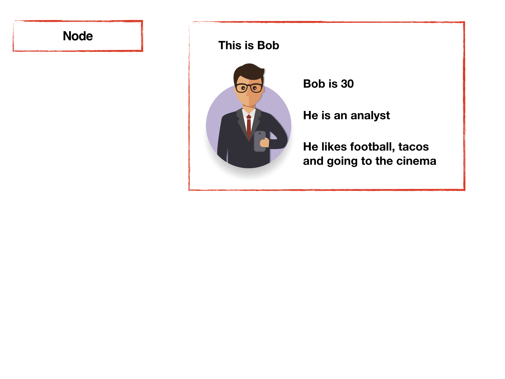
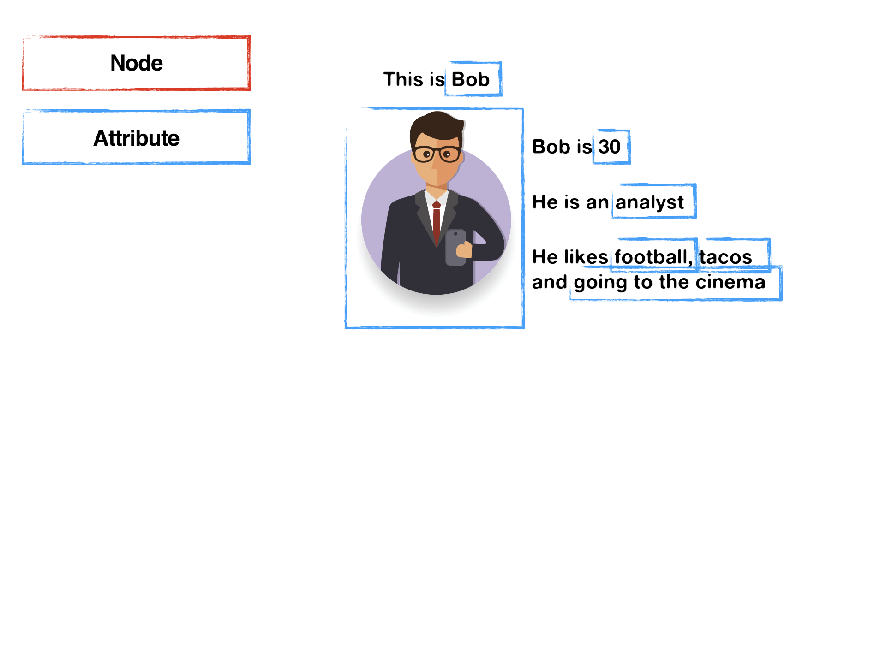
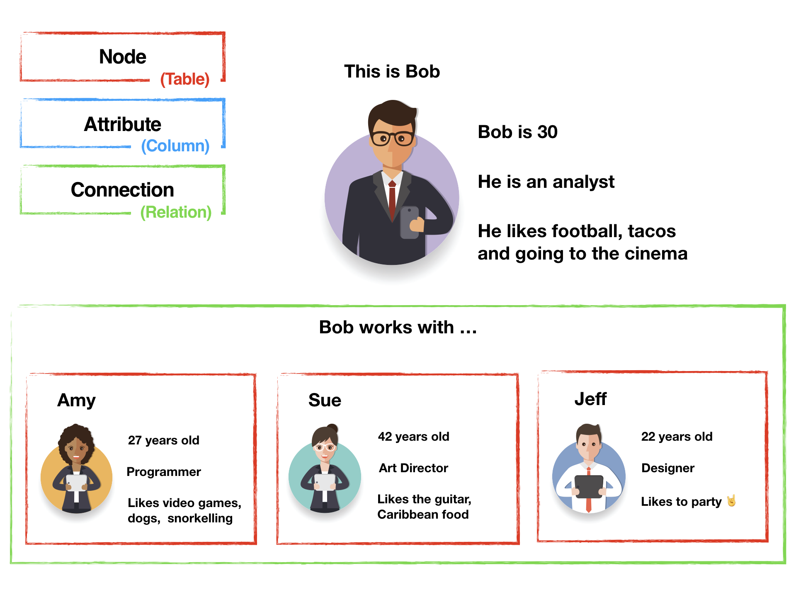
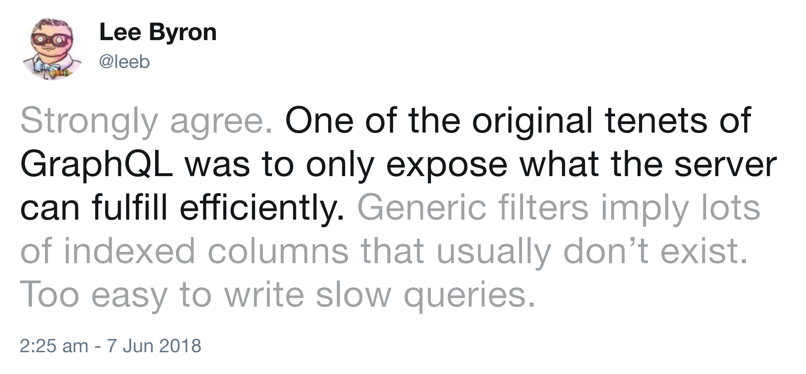

source-file: 000-cover/000-cover.md
source-line: 1
class: title-page bg-blue-home compact-paragraphs

# Database-Driven GraphQL Development

.h2[Benjie Gillam]  
.h4[[PostGraphile](https://graphile.org/postgraphile/) OSS maintainer]

.slidesLocation[
Twitter: [@Benjie](https://twitter.com/Benjie)  
Slides: [https://graphile.org/ddgd](https://graphile.org/ddgd)
]

???

I'm the maintain of PostGraphile,
an open source tool to **help you rapidly design and serve** a
high-performance, secure, client-facing GraphQL API backed primarily
by your PostgreSQL database.

--
source-file: 000-cover/000-cover.md
source-line: 20


---
source-file: 020-main/0100-ddgd.md
source-line: 1
class: has-code compact-paragraphs bigLi

### **Database-Driven GraphQL Development** (DDGD):

.footer[

Slides: [https://graphile.org/ddgd](https://graphile.org/ddgd)  
]

???

Start: 25s  
End: 50s

<!-- prettier-ignore-start -->

--
source-file: 020-main/0100-ddgd.md
source-line: 17
✨ Embraces **database features**  
--
source-file: 020-main/0100-ddgd.md
source-line: 19
🚀 **Accelerates** development  
--
source-file: 020-main/0100-ddgd.md
source-line: 21
⚡️ Produces **lighting fast** APIs  
--
source-file: 020-main/0100-ddgd.md
source-line: 23
<!-- ✅ Guarantees **data consistency**  
-- -->
🤖 Keeps **you** in control of **the data**  

<!-- prettier-ignore-end -->


---
source-file: 020-main/0200-familiar.md
source-line: 1
class: has-code compact-paragraphs bigLi img-50
name: familiar
layout: true

### **Familiar** Data Model

{{content}}

???

Start: 50s  
End: 1m30s

---
source-file: 020-main/0200-familiar.md
source-line: 14

template: familiar



---
source-file: 020-main/0200-familiar.md
source-line: 20

template: familiar
count: false



---
source-file: 020-main/0200-familiar.md
source-line: 27

template: familiar
count: false


---
source-file: 020-main/0200-familiar.md
source-line: 34

template: familiar
count: false




---
source-file: 020-main/0250-declarative.md
source-line: 1
class: has-code compact-paragraphs bigLi
layout: false

### GraphQL is **Declarative**

.footer[

Slides: [https://graphile.org/ddgd](https://graphile.org/ddgd)  
]

.pull-left[

```graphql
{
  hero {
    name
    friends {
      name
    }
  }
}
```

]

???

Start: 1m30  
End: 1m55

One of the things that I think is really powerful about GraphQL is it’s
declarative nature.

--
source-file: 020-main/0250-declarative.md
source-line: 34

.pull-right[

```json
{
  "hero": {
    "name": "R2-D2",
    "friends": [
      { "name": "Luke Skywalker" },
      { "name": "Han Solo" },
      { "name": "Leia Organa" }
    ]
  }
}
```

]
.clear[]

Specifying the precise data requirements helps eliminate client-side **under-** and **over-fetching**.

---
source-file: 020-main/0250-declarative.md
source-line: 56

layout: false
class: has-code compact-paragraphs bigLi

### SQL is **Declarative**

.footer[

Slides: [https://graphile.org/ddgd](https://graphile.org/ddgd)  
]

.pull-left[

```graphql
SELECT name, homeworld
  FROM heroes
  WHERE ...;
```

]

.pull-right[

| name           | homeworld |
| -------------- | --------- |
| R2-D2          | Naboo     |
| Luke Skywalker | Tatooine  |
| Han Solo       | Corellia  |
| Leia Organa    | Alderaan  |

]

.clear[]

???

Start: 1m55  
End: 3m00

The S.Q.L. (or sequel) language used by
databases is also declerative.

--
source-file: 020-main/0250-declarative.md
source-line: 99

SQL is:

<!-- prettier-ignore-start -->

✅ well **established**, widely used  
--
source-file: 020-main/0250-declarative.md
source-line: 106
✅ constantly evolving based on **real-world needs**  
???

Not just the standard, but the various database
vendors are frequently adding new features to their offerings based on the
**real-world needs** of their users.
--
source-file: 020-main/0250-declarative.md
source-line: 113
✅ powered by extremely **advanced query planners**

<!-- prettier-ignore-end -->

???

**complex relational algebra operations**

latest versions even use techniques such as **genetic algorithms** to rapidly figure out
the most efficient query plan

Incredible stuff!


---
source-file: 020-main/0275-guarantees.md
source-line: 1
class: has-code compact-paragraphs bigLi
layout: false

### DDGD: Databases Give **Guarantees**

.footer[

Slides: [https://graphile.org/ddgd](https://graphile.org/ddgd)  
]

???

Start: 3m00  
End: 4m30

Programmers love guarantees!

Transactions - ensure that a series
of statement either **all fail or all
succeed together** - no need to clean
up partial successes.

Also give us guarantees about **data
written to the disk**; ensuring a
consistent application in a similar
way to adding assert() statements
to your application code.

--
source-file: 020-main/0275-guarantees.md
source-line: 29

- Ensure **relations are consistent**:  
  .context[`user_id int`]&nbsp;&nbsp;&nbsp;`REFERENCES users`

???

When user_id 6 is referenced, the database checks that user with id 6 definitely exists.

--
source-file: 020-main/0275-guarantees.md
source-line: 38

- Assert **uniqueness**:  
  .context[`username text`]&nbsp;&nbsp;&nbsp;`UNIQUE`

--
source-file: 020-main/0275-guarantees.md
source-line: 43

- Check data **conforms**:  
  .context[`email text`]&nbsp;&nbsp;&nbsp;`CHECK(email ~ '^[^@]+@[^@]+$')`

--
source-file: 020-main/0275-guarantees.md
source-line: 48
class: hide-footer

Constraints are **guaranteed to remain true**.

???

unlike the checks and validations that we add in the application layer which
only affect the data as it is processed

--
source-file: 020-main/0275-guarantees.md
source-line: 58

class: hide-footer

Ensures **only valid data** goes into/out of our API.


---
source-file: 020-main/0300-mapping.md
source-line: 1
class: has-code compact-paragraphs bigLi
name: productivity
layout: false

### DDGD: **Auto-generation**

.footer[

Slides: [https://graphile.org/ddgd](https://graphile.org/ddgd)  
]

.pull-left[

```sql
CREATE TABLE post (
  id serial primary key,
⁣
  author_id int not null
    references person,
⁣
  blog_id int not null
    references blog,
⁣
  title text not null,
⁣
  body text not null,
⁣
  published_at timestamptz
);
```

]

???

Start: 4m30  
End: 5m00

Convert types, map fields to follow naming conventions, detect relations and add the relevant fields.

- Reduces risk of human error / typos
- Enables you to apply fixes and enhancements to the entire API easily

The result is a very consistent GraphQL schema.

--
source-file: 020-main/0300-mapping.md
source-line: 46

.pull-right[

```graphql
type Post {
  id: Int!
⁣
  authorId: Int!
  author: Person
⁣
  blogId: Int!
  blog: Blog
⁣
  title: String!
⁣
  body: String!
⁣
  publishedAt: String
}
```

]


---
source-file: 020-main/0350-customising.md
source-line: 1
class: has-code compact-paragraphs bigLi
name: customising
layout: true

### DDGD: **Auto-generation**

.footer[

Slides: [https://graphile.org/ddgd](https://graphile.org/ddgd)  
]

???

Start: 5m00  
End: 6m00

When following best practices, we don't want to expose too much.

Use **database permissions to guide us** - only expose the update
mutation if the UPDATE privilege is granted

Don't want to update post ID.

Only expose the fields you're specifically allowed to update.

---
source-file: 020-main/0350-customising.md
source-line: 26

template: customising

.pull-left[

```sql
-- Permissions
GRANT UPDATE
ON post TO graphql_role;
```

]

.pull-right[

```graphql
# Reflected in GraphQL
input PostPatch {
  id: Int
  authorId: Int
  blogId: Int
  title: String
  body: String
  publishedAt: String
}
```

]

.clear[]

---
source-file: 020-main/0350-customising.md
source-line: 58

template: customising
count: false

.pull-left[

```sql
-- Permissions
GRANT UPDATE (
* body,
* published_at
) ON post TO graphql_role;
```

]

.pull-right[

```graphql
# Reflected in GraphQL
input PostPatch {
* body: String
* publishedAt: String
}
```

]

.clear[]

---
source-file: 020-main/0350-customising.md
source-line: 89

layout: false
class: has-code compact-paragraphs bigLi
count: false

### DDGD: **Auto-generation**

.footer[

Slides: [https://graphile.org/ddgd](https://graphile.org/ddgd)  
]

.context[
.pull-left[

```sql
-- Permissions
GRANT UPDATE (
  body,
  published_at
) ON post TO graphql_role;
```

]

.pull-right[

```graphql
# Reflected in GraphQL
input PostPatch {
  body: String
  publishedAt: String
}
```

]
]

.clear[]

.pull-left[

```sql
-- Views create "virtual" tables
CREATE VIEW person AS (
 SELECT id, username, bio
 FROM users, bios
 WHERE user_id = users.id
);
-- Custom data types
CREATE TYPE my_type AS (
  ...
);
```

]

.pull-right[

```graphql
# Which we can expose with GraphQL
type Person {
  id: Int!
  username: String!
  bio: String
}
⁣
type MyType {
  ...
}
```

]

???

Start: 5m30s  
End: 6m00

GraphQL schema does not have to be a perfect
reflection of your database schema or underlying tables

---
source-file: 020-main/0350-customising.md
source-line: 172

layout: false
class: has-code compact-paragraphs bigLi

### DDGD: **Auto-generation - Functions**

.footer[

Slides: [https://graphile.org/ddgd](https://graphile.org/ddgd)  
]

.pull-left[

```sql
-- "Computed column"
CREATE FUNCTION person_name(
  p person
) RETURNS text...
```

]

.pull-right[

```graphql
# Adds field to table type
extend type Person {
  name: String
}
```

]

.clear[]

???

Start: 6m00s  
End: 7m00s

Another way to extend your schema is to really embrace the powerhouse that is
your database.

Postgres for example gives you support for very powerful
functions, which can return anything from scalars to ⏭ set of database records.
These can be used to efficiently add "computed columns" to your tables,
additional queries at the root level, or ⏭ powerful custom mutations.

--
source-file: 020-main/0350-customising.md
source-line: 221

.pull-left[

```sql
-- "Custom query"
CREATE FUNCTION top_posts()
RETURNS SETOF post...
```

]

.pull-right[

```graphql
extend type Query {
  topPosts: PostConnection
}
```

]

.clear[]

--
source-file: 020-main/0350-customising.md
source-line: 245

.pull-left[

```sql
-- "Custom mutation"
CREATE FUNCTION register_person(
  username text,
  password text
) RETURNS person...
```

]

.pull-right[

```graphql
extend type Mutation {
  registerUser(
    username: String,
    password: String
  ): Person
}
```

]

---
source-file: 020-main/0350-customising.md
source-line: 272

class: has-code compact-paragraphs bigLi

### DDGD: **Efficient By Default**

.footer[

Slides: [https://graphile.org/ddgd](https://graphile.org/ddgd)  
]



**Indexes** and **foreign keys** guide schema generation

???

Start: 7m00s  
End: 7m40s

We can automatically ensure we adhere to best practices.

**Performance is not an afterthought**

---
source-file: 020-main/0350-customising.md
source-line: 296

class: has-code compact-paragraphs bigLi

### DDGD: **Adding Power**

.footer[

Slides: [https://graphile.org/ddgd](https://graphile.org/ddgd)  
]

<!-- prettier-ignore-start -->

- Add a **job queue** for background tasks
???

Start: 7m40s  
End: 9m00s

such as sending a verification email to each new email address added.

Can be triggered by a database trigger, giving us another guarantee. Doesn't matter which service triggers it, we know the email will be sent.
--
source-file: 020-main/0350-customising.md
source-line: 318
- Extend with **plugins**, **schema stitching** or **foreign data wrappers**
--
source-file: 020-main/0350-customising.md
source-line: 320
- Tag database entities to **rename/omit/deprecate**

<!-- prettier-ignore-end -->


---
source-file: 020-main/0500-efficient.md
source-line: 1
class: has-code compact-paragraphs bigLi
name: efficient

### **Efficiently** Executing GraphQL with SQL

.footer[

Slides: [https://graphile.org/ddgd](https://graphile.org/ddgd)  
]

.pull-left[

```graphql
{
  posts(where: {
    id: { in: [1, 2, 3] }
  }) {
    id
    title
    author {
      id
      name
    }
  }
}
```

]
???

Start: 9m00  
End: 10m10

DataLoader is inefficient - under-fetching - database roundtrips - increases latency.

Instead...

---
source-file: 020-main/0500-efficient.md
source-line: 38

template: efficient
count: false
class: hide-footer

.pull-right[

```sql
*-- Turn entire GraphQL query into
*-- just one SQL statement.
SELECT
  id,
  title,
  (SELECT json_build_object(
    'id', id,
    'name', name
  ) FROM person WHERE id = author_id)
FROM posts
WHERE id IN (1,2,3);
```

]

.clear[]

**GraphQL Engines** can analyse entire query to help eliminate server-side **over-** and **under-fetching**, and **reduce latency**.

???

Compile the GraphQL query into one SQL query,
**passing the task** of finding the most efficient way of resolving
this request over **to a well-optimised query planner**.

**Using sub-queries to respect the tree-nature of GraphQL**


---
source-file: 020-main/9999-everything.md
source-line: 1
class: has-code compact-paragraphs bigLi

### DDGD: **Data Security**

.footer[

Slides: [https://graphile.org/ddgd](https://graphile.org/ddgd)  
]

???

Start: 10m10s  
End: 12m25s

Until fairly recently database security was not granular
enough

been putting business logic in application layer for so long
now that we think that it's the right way

--
source-file: 020-main/9999-everything.md
source-line: 21

- Row Level Security &mdash; **co-locate** security and data

???
In 2015 Postgres introduced support for row
level security, finally giving us the granular permissions that we need to move
our business logic into the most sensible place - co-located with the data.

Single role, use transaction variables to indicate the current user or session identifier.

--
source-file: 020-main/9999-everything.md
source-line: 32

- Enforces rules on **every data access**

--
source-file: 020-main/9999-everything.md
source-line: 36

- Single database role &mdash; use **transaction variables**

--
source-file: 020-main/9999-everything.md
source-line: 40

- Security **policy statements** &mdash; easy to **audit**

???

GDPR - ability to easily review these policies helps **ensure
we are meeting our data-protection obligations**.

confident - enforced using **well tested, vetted and trusted implementation from
our database vendor**, rather than something that's been developed in-house or by
a third party.

--
source-file: 020-main/9999-everything.md
source-line: 53

- Trusted implementation by **database vendor**

--
source-file: 020-main/9999-everything.md
source-line: 57

- Define once, applied **automatically**

---
source-file: 020-main/9999-everything.md
source-line: 61

class: title-page compact-paragraphs bigLi
layout: false

## DDGD: Summary

⏩ Accelerated development  
⚡️ Lighting-fast APIs  
✅ Data consistency guaranteed  
🤖 Maintain control of database  
🔐 Easily auditable security

.footer[

### [@Benjie](https://twitter.com/Benjie)

Chat: http://discord.gg/graphile  
Slides: [https://graphile.org/ddgd](https://graphile.org/ddgd)  
]

???

Start: 12m25s  
End: 13m15s

I guess at the end of the day the thing that I like most about Database-Driven
GraphQL Development is the speed. Both the speed at which the API can resolve
even complex queries, and the speed with which I can develop a stable, secure
and maintainable API.

Thank you for listening to my talk, I encourage you to embrace the power of the
database, and ⏭ become SQL Superpowered! If you've any questions please come ask
us in the Graphile chat at http://discord.gg/graphile; or message me on Twitter

- I'm @Benjie.

--
source-file: 020-main/9999-everything.md
source-line: 98

class: super

.superpowered[
\#sqlsuperpowered
]
